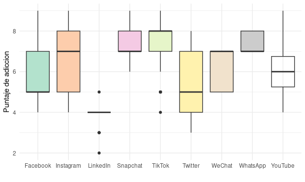

### <b style="font-size: 22px;">Impacto de la Plataforma en la Adicción</b>

**¿Cuál plataforma genera más adicción?** En el gráfico podemos observar que la plataformas que genera mayor adicción en los estudiantes es TikTok, con una mediana de $8$ puntos, seguida de Instagram, Whatsapp, WeChat y Snapchat, todos con una mediana de $7$ puntos. También se evidencia que Snapchat, TikTok y Whatsapp presentan menor variabilidad a diferencia de Instagram y WeChat, cuyas cajas son poco compactas.

**¿Los usuarios de TikTok tienen una mediana de puntaje de adicción más alta que los de LinkedIn o WhatsApp?** Así es, TikTok muestra una mediana de $8$, mientras que LinkedIn tiene una mediana notablemente más baja (alrededor de $4$) y WhatsApp presenta una mediana de $7$, por lo que TikTok supera a ambas.

  

Row
-----------------------------------------------------------------