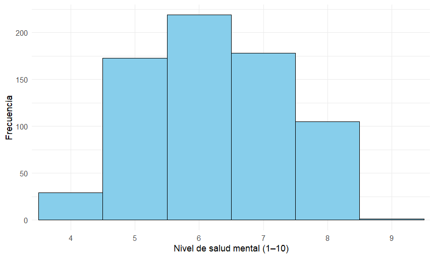

Column {data-width=500}
-----------------------------------------------------------------
### <b style="font-size: 22px;">Impacto de la Plataforma en la Salud</b>

El gráfico nos muestra que la mediana sobre la percepción de la salud mental es la misma para ambos géneros, con una autoevaluación central que se sitúa en $6/10$.
Sin embargo, el grupo de mujeres es más diverso en sus opiniones sobre su salud mental, sus autoevaluaciones están más dispersas o separadas, abarcando en un rango de $5-7$, mientras el grupo de hombres es más consistente en sus respuestas. La gran mayoría se califica con un puntaje $> 6$, lo que indica una percepción de la salud mental de muy buena para la mayoría del grupo.
La percepción central es igual, pero las mujeres tienen opiniones más variadas (menos acuerdo entre ellas), mientras que los hombres tienden a agruparse sólidamente en la banda superior de la autoevaluación.

<div style="position: relative;">

<p align="center">
  
</p>

</div>


Column {data-width=500}
-----------------------------------------------------------------

### <b style="font-size: 22px;">Impacto de las horas de sueño en la percepción de la salud mental</b>

En este gráfico se observa que los datos para cada grado de salud mental están bastante ligados, a los rangos de horas de sueño, dando evidencia que entre mayor es la cantidad de horas de sueño mejor es la autoevaluación de salud mental.

<div style="position: relative;">

```{r, fig.align='center'}
ggplot(datos_estudiantes, aes(x = Sleep_Hours_Per_Night, y = Mental_Health_Score)) +
  geom_jitter(width = 0.2, height = 0.2, alpha = 0.5) +
  geom_smooth(method = "lm", se = FALSE, color = "red") +
  labs(
    x = "Horas de sueño",
    y = "Autoevaluación de Salud Mental (1-10)") +
  theme_minimal()
```

</div>


### <b style="font-size: 22px;">Frecuencias de las autoevaluciones de la salud mental de los estudiantes.</b>

Enl a autoevaluación de salud mental, vemos una distribución similar, con la mayor cantidad de datos concentrados en un valor alrededor de 6, con un CV de 17,7%, lo que también hace a los datos homogéneos y consistentes.

<div style="position: relative;">

<p align="center">
  
</p>

</div>