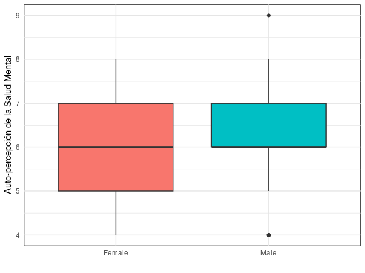

### <b style="font-size: 22px;">Impacto de la Plataforma en la Salud</b>

**¿Existe una diferencia en la mediana de la autoevaluación de salud mental entre hombres y mujeres en la muestra?** El gráfico nos muestra que la mediana sobre la percepción de la salud mental es la misma para ambos géneros, con una autoevaluación central que se sitúa en $6/10$.
Sin embargo, el grupo de mujeres es más diverso en sus opiniones sobre su salud mental, sus autoevaluaciones están más dispersas o separadas, abarcando en un rango de $5-7$, mientras el grupo de hombres es más consistente en sus respuestas. La gran mayoría se califica con un puntaje $> 6$, lo que indica una percepción de la salud mental de muy buena para la mayoría del grupo.
La percepción central es igual, pero las mujeres tienen opiniones más variadas (menos acuerdo entre ellas), mientras que los hombres tienden a agruparse sólidamente en la banda superior de la autoevaluación.

  

Row
----------------------------------------------------------
